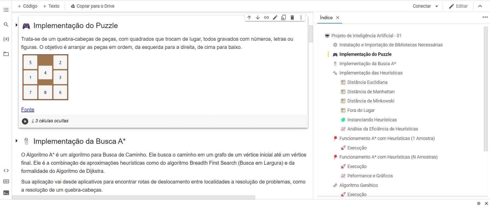

  <h1>🤖 Busca AStar (A*) com Algoritmo Genético (AG)</h1>
  
Projeto da disciplina de Inteligência Artificial (IA) - UFCG

    
     
    

## 📑 Sumário

- [Descrição](#description)
- [Tecnologias](#tecs)
- [Autores](#authors)
- [Licensa](#license)

## 🔖 Descrição 

Utilizando Algoritmo genético para determinação de pesos para funções heurísticas, que serão utilizadas no algoritmo de busca A\* para solucionar um jogo de 8-Puzzle (3x3) ou 15-Puzzle (4x4).

## 🚀 Tecnologias 

- [Python](https://www.python.org/) - Linguagem Utilizada
- [Google Colab](https://colab.research.google.com/) - Plataforma Utilizada
- [Matplotlib](https://matplotlib.org/) - Biblioteca de gráficos
- [Pygad](https://pygad.readthedocs.io/en/latest/) - Biblioteca de algoritmos genéticos

## 🔰 Autores: 

- [@Pedro-Manoel](https://github.com/Pedro-Manoel)
- [@lucasarlim](https://github.com/lucasarlim)
- [@viniciustrr](https://github.com/viniciustrr)
- [@Felipe1496](https://github.com/Felipe1496)
- [@GustavoNeery](https://github.com/GustavoNeery)

## 📃 Licença 

Esse projeto está sob a licença MIT. Veja o arquivo [LICENSE](LICENSE) para mais detalhes.
